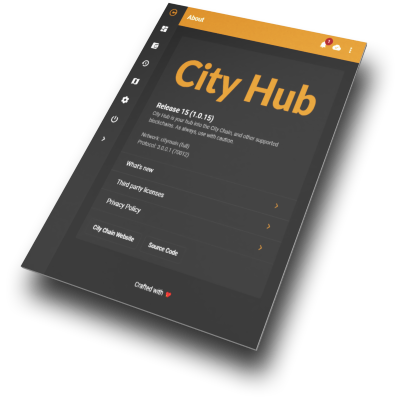

City Chain: Technical White Paper
-----------------------

Updated: **July 27, 2018**

Our technical whitepaper, is our Software Architecture Document. This is a living document that is updated as implementations of features and services is completed, and as the architecture and implementation changes.

**ABSTRACT:** City Chain is a new blockchain and platform, Smart City Platform, that has the purpose of making the technology accessible and useable by everyone. Cities and citizens will be able to use the City Chain to improve how we communicate, socialize, trade and manage our assets (both physical and digital). In addition, it will be possible to reduce costs/overhead for both citizens and cities.

**DISCLAIMER:** This City Chain Technical White Paper is for discussion and information purposes only. The information contained herein is subject to change. No part of this draft document is legally binding or enforceable. City Chain Foundation and City Chain developers does not guarantee the accuracy of or the conclusions reached in this white paper, and this white paper is provided “as is”. City Chain Foundation and City Chain developers does not make and expressly disclaims all representations and warranties, express, implied, statutory or otherwise, whatsoever, including, but not limited to: (i) warranties of merchantability, fitness for a particular purpose, suitability, usage, title or noninfringement; (ii) that the contents of this white paper are free from error; and (iii) that such contents will not infringe third-party rights. City Chain Foundation, City Chain developers and its affiliates shall have no liability for damages of any kind arising out of the use, reference to, or reliance on this white paper or any of the content contained herein, even if advised of the possibility of such damages. In no event will City Chain Foundation, City Chain developers or its affiliates be liable to any person or entity for any damages, losses, liabilities, costs or expenses of any kind, whether direct or indirect, consequential, compensatory, incidental, actual, exemplary, punitive or special for the use of, reference to, or reliance on this white paper or any of the content contained herein, including, without limitation, any loss of business, revenues, profits, data, use, goodwill or other intangible losses.

- [Introduction](#introduction-by-chief-technology-officer)
- [Background](#background)
- [What does it solve](#what-does-it-solve)
- [Consensus Algorithm \(PoS\)](#consensus-algorithm-pos)
- [Accounts and identities](#accounts)
  * [Identities](#identities)
- [Payments](#payments)
  * [Send by e-mail](#send-by-e-mail)
  * [Send by SMS](#send-by-sms)
  * [Send by NFC](#send-by-nfc)
- [Wallets](#wallets)
- [City Hub](#city-hub)
  * [Secure Community](#secure-community)
  * [Contacts](#contacts)
  * [Merchants](#merchants)
  * [Voting Framework](#voting-framework)
  * [Property Registry](#property-registry)
  * [Vehicle Registry](#vehicle-registry)
  * [Insurance](#insurance)
  * [\(Smart\) Contracts](#smart-contracts)
  * [Subscriptions](#subscriptions)
  * [Certifications](#certifications)
- [Tools](#tools)
  * [Block Explorer](#block-explorer)
  * [Network Statistics](#network-statistics)

# Introduction

We believe in improving every citizen's quality of life. That is why we are building City Chain and the Smart City Platform.

The promises of Bitcoin, blockchain and other cryptocurrencies, is not being fully 
realized in today's society. This is primarily cause by the existing system of economics 
and trade being tied to fiat currencies, money that is produced and controlled by 
governments and central banks.

While there are millions of people that hold Bitcoin today, their utilization as money 
is limited. Most usage require the exchange from Bitcoin, to a local fiat currency that 
is accepted by a merchant. Gift cards, credit cards and other solutions do help improve 
this situation, by allowing consumers to more directly exchange digital money, for 
goods and services, without an implicit exchange to fiat currency.

We believe to gain the full benefit of Bitcoin and blockchain technology, we need to
establish solutions that works for everyone, that is simple to understand, easy to use,
and that helps both consumers and merchants alike.

We also believe that the best way to fully gain the benefits, we need to start building
new cities. New cities that from the ground up have a more  open and free policy of 
monetary exchange. Most states today, have laws that require the acceptance and usage
of their fiat money. We think competition and freedom is the way forward, to find
the most optimal and best solutions for money. We want not only a free market of goods 
and services, we also want a free market of money.

City Chain is both a blockchain technology, and it is a chain of private cities. 
We are building City Chain and the Smart City Platform, to enable new private startup 
cities to have the tools they need, to increase the development speed, reduce costs of 
planning and operating the city.

The first application of City Chain, is the City Coin (CITY) cryptcurrency.

**Sondre Bjellås**   
Chief Technology Officer, City Chain Labs

# Background

The background for City Chain started with the planning and development of Norway's first private city, Liberstad. As we started working on the development of the city, we realize that there are some missing pieces in the blockchain-space and there are ways to optimize how cities operates, and how citizens interact with each other and their cities.

# What does it solve
We saw that there was a technical hurdle to get the average individual into the ideas, concepts and usage of crypto-currencies. We also quickly learnt that cities are still far behind in the utilization and development of blockchain solutions, so we had to make our own.

For global widespread usage of blockchain technology, it has to become the foundation and the prefered means of transactions for the majority of people. To achieve this, City Chain will develop solutions that improve and enable:

- Merchants to quickly and easily accept crypto-currencies as a payment method.
- Citizens to quickly and easily perform payments to friends, family, associates and merchants.
    * Payments should be possible using e-mail (P2M/P2MPH), SMS (P2PN/P2SMS), NFC, and using contact list without knowing, sharing or pasting any addresses.
    * Perform payments with on-the-fly currency conversion.
- Full overview through a hub of investements, manage assets (digital and physical).
- Manage certifications, uploading third party certificates and signing them for digital verification.
- Property registry with insight into owned land.
- ... and a lot more, please refer to the [website](https://city-chain.org/) for more details.

# Consensus Algorithm (PoS)
City Chain utilize Proof-of-Stake as oppose to Proof-of-Work (Bitcoin). We do this for a number of reasons:

* Reduce the demand for electric energy and hardware investements for stakers ("miners").
* Deterministic block interval.
* Avoid competition with Bitcoin and other blockchains for the available PoW-hashpower.

City Chain use version 3 of PoS. City Chain commits to keep investigating and following the development of PoS consensus algorithms and perform upgrades and modifications in the future. This might result in soft- and/or hard-forks. Modifications to the PoS algorithms will be done to ensure the stability, safety and security of the blockchain-network.

# Accounts

Accounts on the City Chain and Smart City Platform, is the same as most blockchains today. By relying on a 12 word recovery phrase (mnemonic) which will act as the seed for derived private/public key pairs, you can access all your data, coins and information.

# Identities

The platform allows anyone to create their own identity and be that, or any other of multiple identities, in all interactions on the platform and by commerce both online and in stores.

City Chain will allow anyone to create their new identities and become those identities, and not rely on the name and identity created at birth.

You are the source of your identities, and how and what you identity as, is up to you. If you want to change your name that you are using for trades and interactions with anyone, that is available to you. You can choose to have a single identity, or multiple.

As you interact with others through the Smart City Platform, your identities will build up trust. Similar to how trust is important in a human society today, it will be even more important in the digital space going forward.

We plan to support the [Decentralized Identifiers](https://w3c-ccg.github.io/did-spec/) (DIDs) specification, including implementation of Universal Resolver, Universal Registrar and Identity Hubs. By implementing these open specifications, you can potentially use your identity on the City Chain, to authenticate across multiple desentralized blockchains and systems.

Integration with other blockchains are planned for the identity framework, including Keybase.io.

# Payments

Performing payments on the platform will be possible in as many ways and forms as possible, to increase adoption and ussage. We will be implementing some innovative ideas such as sending funds by e-mail to new users.

## Send by e-mail

This is a very interesting idea, and the concept is that from within the City Chain wallet, or the City Hub, a user should be able to send funds by only knowing their e-mail address. When sending by e-mail, it should be possible to add a PIN/password as an additional security factor, but shouldn't be a requirement for smaller payments.

When a person receives the funds by e-mail, they will be welcomed with easy to follow instructions on how to get started with City Chain and how to transfer the funds to their newly created accounts.

If a new user is created, and their e-mail address is added to the identity created, friends, family and contacts will in the future be able to perform transfers directly without going through e-mail, which is less secure.

We are consider two methods, P2M ("Pay to e-Mail") and P2MPH ("Pay To e-Mail Public Hash"), where the form is using the contact registry, while the second is more of an e-mail based banking, similar to P2SMS.

## Send by SMS

P2PN and P2SMS are two methods we want to implement for sending funds by SMS. 

The first one is "Pay To Phone Number", which is relying on the platform contact registry to find the address of a person who is either in the contact registry of the person sending funds, or to someone who has choosen to publicly expose some of their contact information.

The second payment method, "Pay To SMS Public Key Hash", is method to perform payments over SMS, which is a form of banking service through SMS, where the user doesn't need to be using any other part of the platform.

## Send by NFC

We want to add NFC payment support for our mobile wallet app. Security is important, so this will likely be implemented with payment limit over NFC with a separate funding address where user can pick the maximum limit. Auto-refund of NFC addresses is something to look into if possible to do.

NFC payments should be possible between two mobile users, and between consumer and merchant that uses an City Chain compatible PoS (Point-of-Sale) terminal.

# Wallets

City Hub will be the primary wallet for City Chain. We will be working with third party wallets to enable support for City Coin, 
but to fully utilize the City Chain and the Smart City Platform, the City Hub is the prefered app.

Other third party wallet apps give users the basic needs to perform transactions and other related tasks. The full set of City Chain and Smart City Platform functionality, is accessible through the City Hub.

# City Hub

     
The City Hub is the one-stop-app that citizens, merchants and others can get an overview of everything related to their data on the City Chain and the Smart City Platform.

City Hub is a HTML-based frontend, and is built on Angular.

A user who runs the full node edition of City Hub, will then be able to earn some fees from sharing a configureable amount of disk storage for encrypted data on the Smart City Platform.

City Hub supports different usage modes, and from launch supported desktop and mobile support is coming in a future update.

- Mobile - Mobile optimized, released to appstores on Android and iOS.
- Light - Light node UI that does not require download of full blockchain.
- Full - Full node UI that support staking, and does a complete verification of the blockchain.
- Point-of-Sale (POS) - Merchant UI that is optimized for touch screen usage.
- Read-only - A more secure mode that allows you to see all your data, without using your private key.

## Secure Community

We believe it is important for citizens to have the ability to communicate freely and entirely without anyone being able to listen inn on conversations. This can be conversations between medical doctors and patiens, or between a citizen and municipality, between friends and family, or any other mode of communication that might take place in the modern city life.

Today a lot of this communication happens through e-mail, social media and custom solutions, especially for medical and government communication. Often are these hosted by global corporations that citizens have little to no insight into how they store and use data.

The secure community on City Chain, is a solution that does complete end-to-end encryption with no ability for anyone to "listen in" on the conversations.

To do this, this functionality relies on modern technologies available in the latest web browsers. This functionality will only be supports on the latest and most secure browsers.

There is one importan way the secure community on City Chain is very different from every other encrypted and secure communication solution, and that is that the information is by default never stored on any other computer or server than those who are members. By paying a small fee, a community can use full nodes to store encrypted archieves of communities.

## Contacts

One of today's biggest hurdles for crypto-currencies is the lack of a contact register where a user can easily send funds to either people who are already in their address books, or to other that choose to publicly make their information available.

The contact registry will obviously be a feature on the Smart City Platform that gives citizens full control of what data they want to share, and how it is shared.

## Merchants

Merchants is one of the most important part of City Chain and crypto-currencies in general. Without merchants that are willing to accept crypto-currency, then most users would not have a way of spending their digital money.

City Chain want to deliver complete solutions to merchants that are easy to get started.

The merchant framework on the platform is a very important piece of the whole. The platform will enable existing merchants to improve their sales and customer experiences, but the platform will also enable just about anyone, to become a merchant that sells goods and services, both online and offline in the world.

Stability is often important for a merchant, so the framework will support the ability to receive payment in the currency of choice by the merchant. If you want to have a local fiat currency, you can do so. If you want a mix of currencies, that is possible too.

Integrations with existing webshop frameworks will be added, allowing merchants to easily integrate into the Smart City Platform, while continue to use existing software for online trading.

Merchant registry will be part of the merchant framework, and allow citizens to discover the merchants that are available in various cities. These have metadata registered informing citizens what services are provided, and how payments can be done. This enables you as a citizen, to pick providers that use modern technologies such as crypto-currencies, and which merchant that integrates into the Smart City Platform. This enables you to have a more detailed transaction history, than what you otherwise would have.

## Voting Framework

Humans often have a need to have their voice heard. Part of that, is the ability to vote on issues of concern. As either a citizen, or employee, we want to feel we have an impact on major decisions being made.

Part of the Smart City Platform, will be the voting framework, which will enable anyone to create voting polls, that will be both transparent, secure and anonymous (if needed). You as the user of this service, can set and configure how you want to a voting to be executed.

The voting framework will be used by the Liberstad Incubator Program (LIP), to allow investors to vote on suggested applications to the incubator program. It will also be used by the City Chain Foundation, allowing individuals who hold City Coins to vote on issues, suggestions and more.

## Property Registry

Property registry built on blockchain for property registrations will be part of the Smart City Platform, likely through integration with other existing blockchains built for the specific purpose of property registrations.

There are already governments that have started using blockchain for property registrations, and what is important on the Smart City Platform, is for citizens to be able to see their properties and all the details that belongs to it.

## Vehicle Registry

As an owner of vehicles, you will be able to register your vehicles on the City Hub. Integration with either/or both the VINchain and carVertical will ensure that you, have access too all the relevant details and history of your vehicles.

## Insurance

Insurance is an important part of a modern society, helping individuals, families and business survive the unforseen.

There are existing established and under development, insurance-platforms on blockchain technologies. The Smart City Platform will be built with integrations into existing insurance blockchain platforms, allowing citizens and others to get insurance coverage easy and seamless. Etherisc and Insurepal are two potential platforms for insurance integration.
## (Smart) Contracts

In life we have many different contracts that we have signed with others. This module on the Smart City Platform, gives you an overview of all your contracts that are enacted on blockchain-technologies. You can additionally upload and safely store copies of contracts that you scan.

This module also allows you to import the details of any token-based smart contracts you have purchased. In the first version support for Ethereum will be added, and other smart contract platforms might be supported in the future based on user demand.

## Subscriptions

Life in the city often involves subscriptions that have a recurring payment. This module on the Smart City Platform, gives you insight into all subscription contracts you have, either with the city services, or with any other merchant.

Most of the time today, we as citiziens don't know much about the services we subscribe to, what payment and service plans we subscribe to, and others details. Some services only supply some details through regular mail, while others have limited self-service ability through their websites. We need to login at every individuals service, with no easy overview and control.

The promise of the subscriptions module on the platform, is the ability to get better insight into your existing subscriptions, and improved visibility into possible subscriptions available in the city and beyond.

Examples on subscriptions you might have stored on the platform, includes waste services, water services, city-bicycle rental, city-car sharing and more.

## Certifications

Digitizing and verifying academic credentials will be part of the platform. This can be used as a foundation for corporations to validate employment candidates, and it can be used by private or public educators to give cryptographically verifiable certifications.

# Tools

While the majority of software functionality developed on City Chain will be part of either the City Chain blockchain or the Smart City Platform and it's City Hub, there will be some tools that are stand-alone and adds additional value to the City Chain ecosystems.

## Block Explorer

City Chain Labs is hosting an official block explorer, and we might help with contribution on some of the many various block explores that exists, to make sure they work well with the City Chain blockchain.

[https://explorer.city-chain.org/](https://explorer.city-chain.org/)

## Insight

City Chain Labs is hosting and developing a dashboard and API that is made available to the community and users to gain insight in the economics behind City Coin.

City Chain Insight will provide details such as circulating supply, total supply, daily market volume, average market prices and more.

[https://insight.city-chain.org/](https://insight.city-chain.org/)

## Get started

A website that is easier for new users to quickly learn about City Chain is developed and made available.

[https://start.city-chain.org/](https://start.city-chain.org/)

## Network Statistics

Based on Grafana, InfluxDB and a specialized version of the full node client, we'll develop a network statistics solution that is similar to [Statoshi](http://statoshi.info/) and [P2SH](https://p2sh.info/).

## Version History

- Draft #2: February 6, 2019
- Draft #1: July 27, 2018
