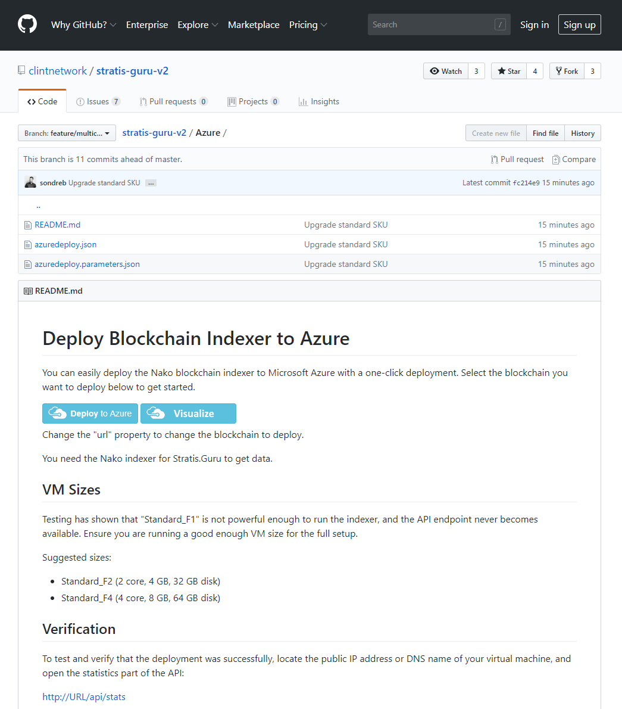
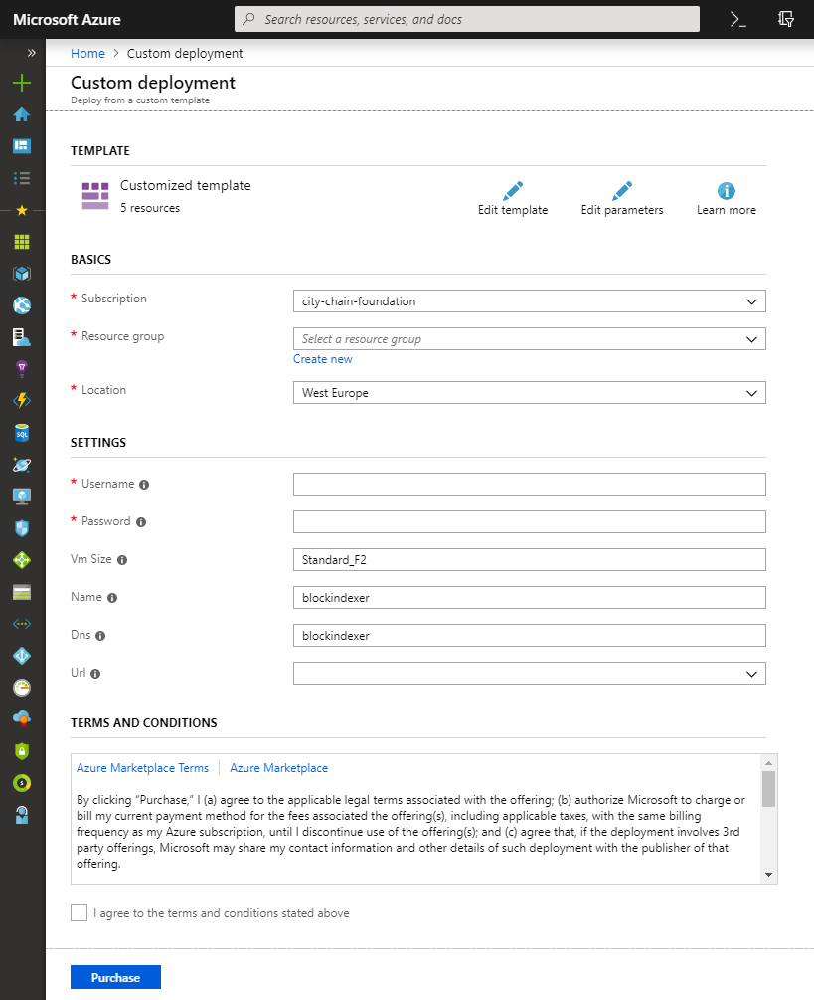
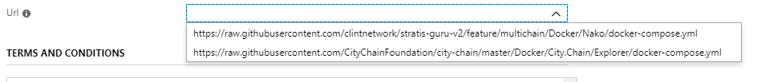
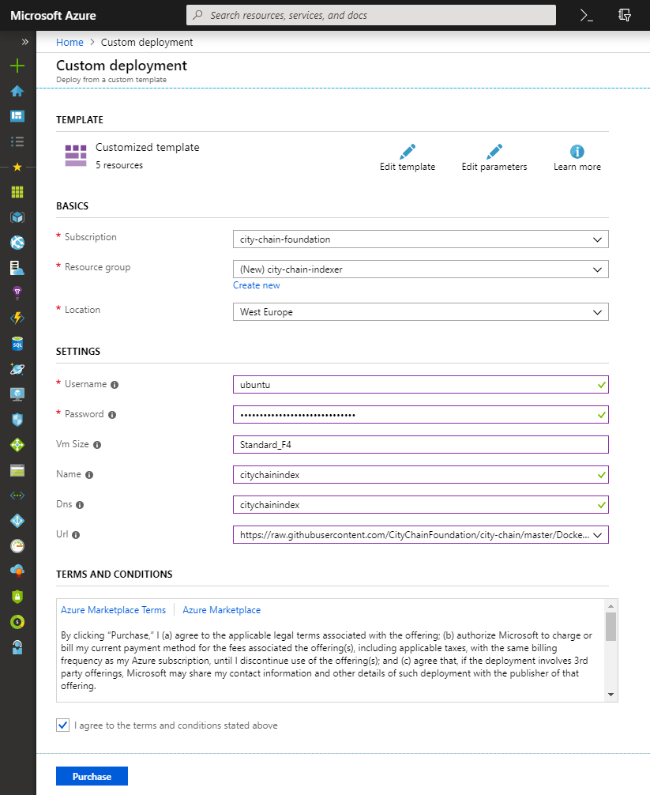
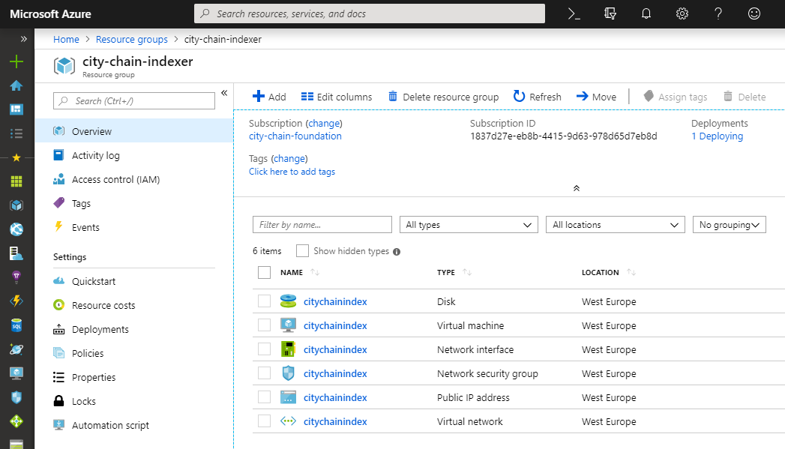
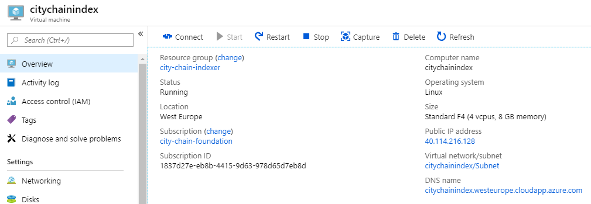
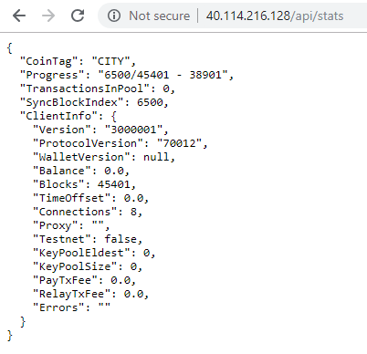
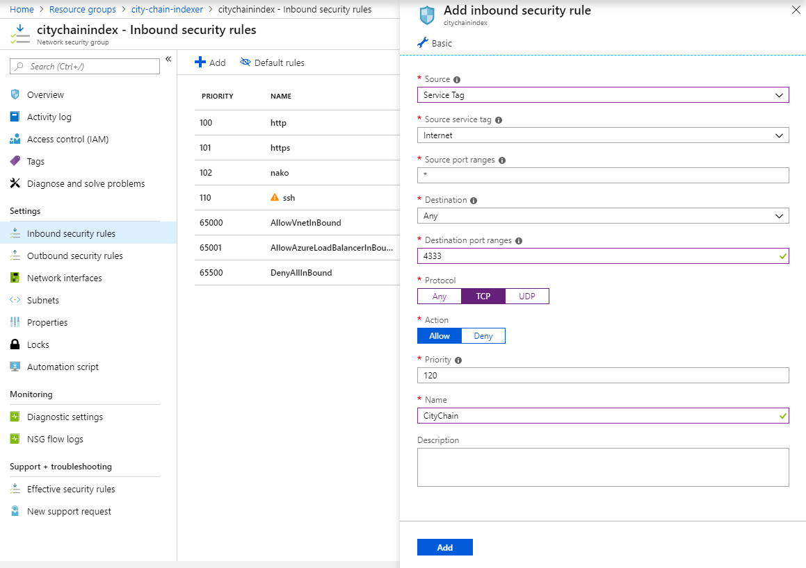

# How to easily deploy the City Chain block indexer to Microsoft Azure

The block indexer is based on the [Nako](https://github.com/CoinVault/Nako) indexer by CoinVault.

Navigate to the following page and click the "Deploy to Azure" button.

Then follow the instructions below.
[https://github.com/clintnetwork/stratis-guru-v2/tree/feature/multichain/Azure](https://github.com/clintnetwork/stratis-guru-v2/tree/feature/multichain/Azure)

## 1. Initiate deployment from browser

You can either download the azuredeploy.json and the azuredeploy.parameters.json and deploy using Azure CLI / PowerShell, or you can do it directly by clicking the Deploy to Azure button.



Here is the alternative to initiate deployment with Azure CLI:

```sh
az group deployment create --g city-chain-indexer --template-file azuredeploy.json --parameters @azuredeploy.parameters.json
```

## 2. Fill out configuration

This is the initial screen you see when the Azure portal loads.



In the configuration parameters, you can choose what blockchain to deploy. More options will be available here in the future.



When all fields have been filled out, you must accept the standard agreements and click "Purchase".



## 3. Verification of deployment

It can take a while for everything to setup and install. Additionally it takes a little while until after the blockchain daemon have started, that the whole indexing process has begun to work.

Navigate to your resource group, and you should see the following resources:



Open the virtual machine resource, and note down (copy) the IP address or the DNS name of your virtual machine.



Then open your browser and navigate to the IP/DNS with /api/stats in the URL. This should show some statistics on the synchronization and indexing of blockchain history.

Please be patient, as it can take a while for the URL to respond correctly. It should normally take much less than an hour.



## 4. Participate in the network

Blockchain networks are dependent on public full nodes that are hosted by individuals such as yourself. Consider opening up the P2P TCP port, which will make your node a public node that can accept incoming connections from other users.

Open the network security group resource, and add a new entry in the firewall that opens the P2P that the network you just deployed runs on. Different blockchains runs on different ports.

The standard port for City Chain is 4333.



## 5. Use the API

To learn more about the possible API methods, check out the Nako repo:

[https://github.com/CoinVault/Nako](https://github.com/CoinVault/Nako)
